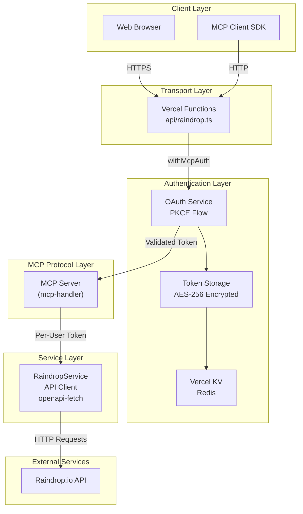
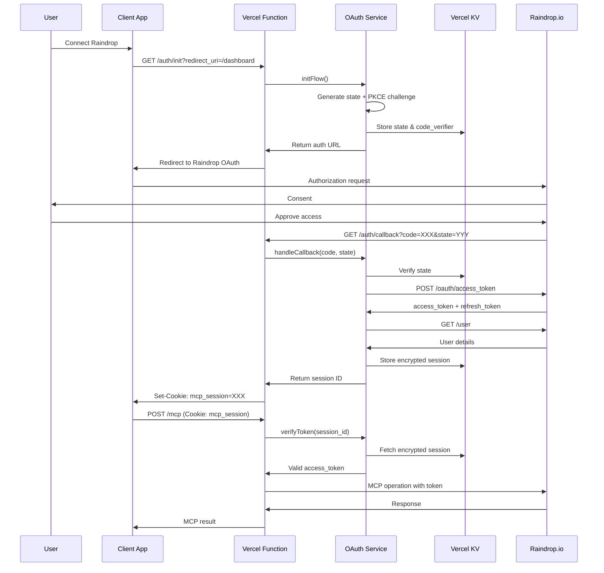
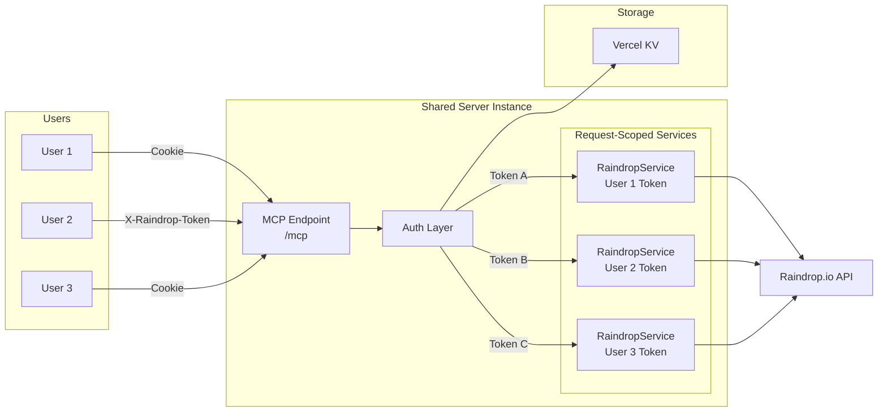

# Raindrop.io MCP Server

A Model Context Protocol (MCP) server for Raindrop.io. It exposes bookmarks, collections, tags, and highlights to MCP clients over Streamable HTTP with OAuth or direct token auth.

## Features

- Collections: list, manage, merge, clean, reorder, cover upload
- Bookmarks: search, create/update/delete, bulk create/delete, file/cover upload
- Tags: list, rename, merge, delete
- Highlights: list, create, update, delete
- OAuth 2.0 + PKCE or direct token auth
- Vercel serverless deployment

## Requirements

- Node.js 18+ (or Bun)
- Raindrop.io account
- One auth method:
  - OAuth app + Vercel KV, or
  - Raindrop API token

## Setup

Install dependencies:

```bash
npm install
```

## Environment Variables

OAuth (recommended for production):

- `OAUTH_CLIENT_ID`
- `OAUTH_CLIENT_SECRET`
- `OAUTH_REDIRECT_URI` (e.g. `https://raindrop-mcp.anuragd.me/auth/callback`)
- `OAUTH_ALLOWED_REDIRECT_URIS` (comma-separated)
- `TOKEN_ENCRYPTION_KEY` (64 hex chars)
- `KV_REST_API_URL` and `KV_REST_API_TOKEN` (from Vercel KV)

Direct token (single-user):

- `RAINDROP_ACCESS_TOKEN`

Optional:

- `API_KEY` (server protection)

## Deploy (Vercel)

```bash
npm run deploy:vercel
```

## MCP Client Configuration

```json
{
  "mcpServers": {
    "raindrop": {
      "url": "https://raindrop-mcp.anuragd.me/mcp",
      "transport": "streamable-http"
    }
  }
}
```

If using direct token auth:

```json
{
  "mcpServers": {
    "raindrop": {
      "url": "https://raindrop-mcp.anuragd.me/mcp",
      "transport": "streamable-http",
      "headers": {
        "X-Raindrop-Token": "your_token"
      }
    }
  }
}
```

## Endpoints

- `POST /mcp` (Streamable HTTP)
- `GET /.well-known/oauth-protected-resource`
- `GET /.well-known/oauth-authorization-server`
- `GET /health`
- `GET /auth/init`, `GET /auth/callback`

## Tools

Collections:
- `collection_list`
- `collection_children_list`
- `collection_manage`
- `collection_bulk_delete`
- `collection_reorder`
- `collection_expand`
- `collection_merge`
- `collection_clean`
- `collection_empty_trash`
- `collection_cover_upload`
- `user_stats`

Bookmarks:
- `bookmark_search`
- `bookmark_manage`
- `bookmark_cache`
- `bookmark_suggest_existing`
- `bookmark_bulk_create`
- `bookmark_bulk_delete`
- `bookmark_file_upload`
- `bookmark_cover_upload`
- `bulk_edit_bookmarks`
- `bookmark_statistics`

Tags:
- `tag_list`
- `tag_manage`

Highlights:
- `highlight_manage`

## Architecture



## OAuth Flow



## Multi-Tenant Model



## Development

```bash
npm run dev
npm run type-check
npm run test
```

## Troubleshooting

- 401: missing auth (OAuth flow not completed or no X-Raindrop-Token)
- 406: client must send `Accept: application/json, text/event-stream`
- 500: check logs and token validity

## License

MIT
