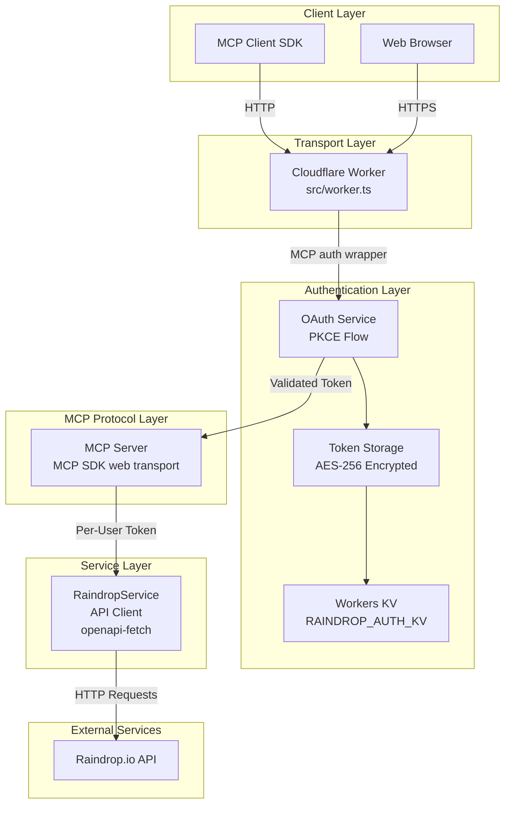
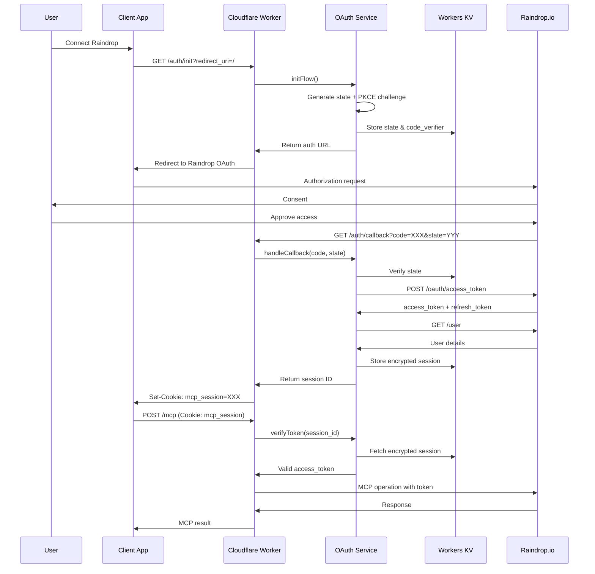
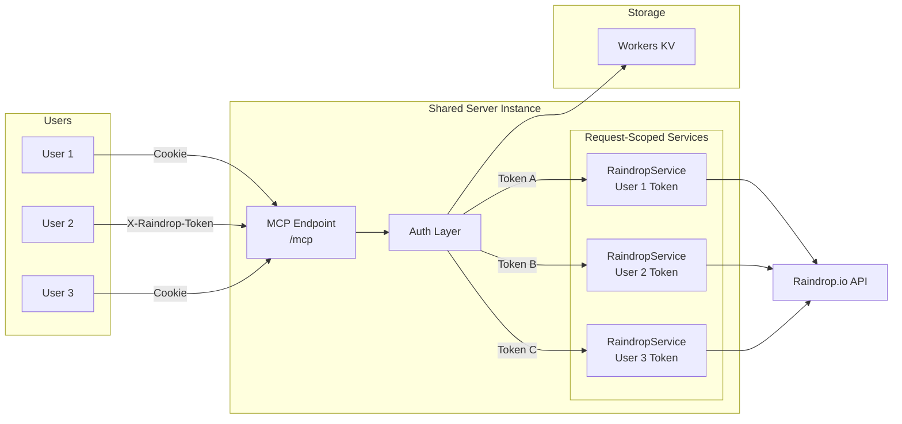

# Raindrop.io MCP Server

A Model Context Protocol (MCP) server for Raindrop.io. It exposes bookmarks, collections, tags, and highlights to MCP clients over Streamable HTTP with OAuth or direct token auth.

## Features

- Collections: list, manage, merge, clean, reorder, cover upload
- Bookmarks: search, create/update/delete, bulk create/delete, file/cover upload
- Tags: list, rename, merge, delete
- Highlights: list, create, update, delete
- OAuth 2.0 + PKCE or direct token auth
- Cloudflare Workers deployment with Workers KV-backed OAuth storage

## Requirements

- Bun 1.0+
- Cloudflare account with Workers enabled
- Raindrop.io account
- One auth method:
  - Raindrop OAuth app + Workers KV, or
  - Raindrop API token

## Setup

Install dependencies:

```bash
bun install
```

## Environment Variables

OAuth (recommended for production):

- `OAUTH_CLIENT_ID`
- `OAUTH_CLIENT_SECRET`
- `OAUTH_REDIRECT_URI` (e.g. `https://raindrop-mcp.anuragd.me/auth/callback`)
- `OAUTH_ALLOWED_REDIRECT_URIS` (comma-separated)
- `TOKEN_ENCRYPTION_KEY` (64 hex chars)
- `JWT_SIGNING_KEY`
- `RAINDROP_AUTH_KV` Workers KV binding configured in `wrangler.jsonc`

Direct token fallback (single-user):

- `RAINDROP_ACCESS_TOKEN`
- `ALLOW_ENV_TOKEN_AUTH=true`

The deployment-wide `RAINDROP_ACCESS_TOKEN` fallback is not recommended for production. It is only active when `ALLOW_ENV_TOKEN_AUTH` is explicitly set to `true`; prefer OAuth or per-request `X-Raindrop-Token` auth for production use.

## Deploy (Cloudflare Workers)

```bash
bunx wrangler login
bun run cf:kv:create
# copy the printed KV ids into wrangler.jsonc, then set secrets with wrangler
bun run deploy:cloudflare
```

See [docs/DEPLOYMENT.md](docs/DEPLOYMENT.md) for the full Cloudflare setup and smoke tests.

## MCP Client Configuration

```json
{
  "mcpServers": {
    "raindrop": {
      "url": "https://raindrop-mcp.anuragd.me/mcp",
      "transport": "streamable-http"
    }
  }
}
```

If using direct token auth:

```json
{
  "mcpServers": {
    "raindrop": {
      "url": "https://raindrop-mcp.anuragd.me/mcp",
      "transport": "streamable-http",
      "headers": {
        "X-Raindrop-Token": "your_token"
      }
    }
  }
}
```

## Endpoints

- `POST /mcp` (Streamable HTTP)
- `GET /.well-known/oauth-protected-resource`
- `GET /.well-known/oauth-authorization-server`
- `GET /health`
- `GET /auth/init`, `GET /auth/callback`

## Tools

Collections:
- `collection_list`
- `collection_children_list`
- `collection_manage`
- `collection_bulk_delete`
- `collection_reorder`
- `collection_expand`
- `collection_merge`
- `collection_clean`
- `collection_empty_trash`
- `collection_cover_upload`
- `user_stats`

Bookmarks:
- `bookmark_search`
- `bookmark_manage`
- `bookmark_cache`
- `bookmark_suggest_existing`
- `bookmark_bulk_create`
- `bookmark_bulk_delete`
- `bookmark_file_upload`
- `bookmark_cover_upload`
- `bulk_edit_bookmarks`
- `bookmark_statistics`

Tags:
- `tag_list`
- `tag_manage`

Highlights:
- `highlight_manage`

## Architecture


```mermaid
graph TB
    subgraph "Client Layer"
        Browser[Web Browser]
        MCPClient[MCP Client SDK]
    end

    subgraph "Transport Layer"
        Worker["Cloudflare Worker\nsrc/worker.ts"]
    end

    subgraph "Authentication Layer"
        OAuth["OAuth Service\nPKCE Flow"]
        TokenStorage["Token Storage\nAES-256 Encrypted"]
        WorkersKV["Workers KV\nRAINDROP_AUTH_KV"]

        OAuth --> TokenStorage
        TokenStorage --> WorkersKV
    end

    subgraph "MCP Protocol Layer"
        MCPService["MCP Server\nMCP SDK web transport"]
    end

    subgraph "Service Layer"
        RaindropService["RaindropService\nAPI Client\nopenapi-fetch"]
    end

    subgraph "External Services"
        RaindropAPI[Raindrop.io API]
    end

    MCPClient -->|HTTP| Worker

    Browser -->|HTTPS| Worker
    Worker -->|MCP auth wrapper| OAuth
    OAuth -->|Validated Token| MCPService
    MCPService -->|Per-User Token| RaindropService
    RaindropService -->|HTTP Requests| RaindropAPI
```

## OAuth Flow


```mermaid
sequenceDiagram
    participant User
    participant Client as Client App
    participant Worker as Cloudflare Worker
    participant OAuth as OAuth Service
    participant KV as Workers KV
    participant Raindrop as Raindrop.io

    User->>Client: Connect Raindrop
    Client->>Worker: GET /auth/init?redirect_uri=/
    Worker->>OAuth: initFlow()
    OAuth->>OAuth: Generate state + PKCE challenge
    OAuth->>KV: Store state & code_verifier
    OAuth->>Worker: Return auth URL
    Worker->>Client: Redirect to Raindrop OAuth
    Client->>Raindrop: Authorization request
    Raindrop->>User: Consent
    User->>Raindrop: Approve access
    Raindrop->>Worker: GET /auth/callback?code=XXX&state=YYY
    Worker->>OAuth: handleCallback(code, state)
    OAuth->>KV: Verify state
    OAuth->>Raindrop: POST /oauth/access_token
    Raindrop->>OAuth: access_token + refresh_token
    OAuth->>Raindrop: GET /user
    Raindrop->>OAuth: User details
    OAuth->>KV: Store encrypted session
    OAuth->>Worker: Return session ID
    Worker->>Client: Set-Cookie: mcp_session=XXX
    Client->>Worker: POST /mcp (Cookie: mcp_session)
    Worker->>OAuth: verifyToken(session_id)
    OAuth->>KV: Fetch encrypted session
    OAuth->>Worker: Valid access_token
    Worker->>Raindrop: MCP operation with token
    Raindrop->>Worker: Response
    Worker->>Client: MCP result
```

## Multi-Tenant Model


```mermaid
graph LR
    subgraph "Shared Server Instance"
        Endpoint["MCP Endpoint\n/mcp"]
        Auth[Auth Layer]

        subgraph "Request-Scoped Services"
            Service1["RaindropService\nUser 1 Token"]
            Service2["RaindropService\nUser 2 Token"]
            Service3["RaindropService\nUser 3 Token"]
        end
    end

    subgraph "Users"
        User1[User 1]
        User2[User 2]
        User3[User 3]
    end

    subgraph "Storage"
        KV["Workers KV"]
    end

    User1 -->|Cookie| Endpoint
    User2 -->|X-Raindrop-Token| Endpoint
    User3 -->|Cookie| Endpoint

    Endpoint --> Auth
    Auth --> KV

    Auth -->|Token A| Service1
    Auth -->|Token B| Service2
    Auth -->|Token C| Service3

    Service1 --> API[Raindrop.io API]
    Service2 --> API
    Service3 --> API
```

## Development

```bash
bun run dev
bun run type-check
bun test
```

## Troubleshooting

- 401: missing auth (OAuth flow not completed or no X-Raindrop-Token)
- 406: client must send `Accept: application/json, text/event-stream`
- 500: check logs and token validity

## License

MIT
