# Raindrop.io MCP Server

A Model Context Protocol (MCP) server for interacting with [Raindrop.io](https://raindrop.io/) bookmarking service. This allows AI assistants like Claude to manage your bookmarks, collections, tags, and highlights.

**Now with HTTP transport and serverless deployment support!** 🚀

## Features

- 📚 **Collection Management** - Create, update, delete, and list collections
- 🔖 **Bookmark Operations** - Full CRUD operations for bookmarks with advanced search
- 🏷️ **Tag Management** - List and organize tags across collections
- ✨ **Highlight Support** - Create and manage text highlights with color coding
- ⚡ **Bulk Operations** - Update multiple bookmarks efficiently
- 🔗 **Resource Links** - Efficient data access using MCP resource link pattern
- 🛡️ **Type Safe** - Full TypeScript implementation with Zod validation
- 🌐 **HTTP Transport** - Remote access via Server-Sent Events (SSE)
- ☁️ **Serverless Ready** - Deploy to Vercel or Cloudflare Workers
- 🔐 **OAuth 2.0 Authentication** - Secure multi-user access with PKCE flow
- 👥 **Multi-Tenant** - Support multiple users with per-request authentication
- 🔄 **Token Refresh** - Automatic token renewal without re-authentication
- 🔒 **Encrypted Storage** - AES-256-GCM encryption for tokens at rest
- 🌍 **Edge Computing** - Global low-latency access with Cloudflare Workers

## Transport Modes

The server supports multiple transport mechanisms:

| Transport | Use Case | Setup Difficulty |
|-----------|----------|-----------------|
| **STDIO** | Local Claude Desktop | Easy ⭐ |
| **HTTP/SSE** | Remote access, development | Medium ⭐⭐ |
| **Vercel** | Serverless, Node.js apps | Medium ⭐⭐ |
| **Cloudflare Workers** | Edge computing, global access | Medium ⭐⭐ |

## Architecture

### System Overview


### Authentication Flow


### Multi-Tenant Architecture

```mermaid
graph LR
    subgraph "Shared Server Instance"
        Endpoint[MCP Endpoint<br/>/mcp]
        Auth[Auth Layer]

        subgraph "Request-Scoped Services"
            Service1[RaindropService<br/>User 1 Token]
            Service2[RaindropService<br/>User 2 Token]
            Service3[RaindropService<br/>User 3 Token]
        end
    end

    subgraph "Users"
        User1[👤 User 1<br/>Session/Token]
        User2[👤 User 2<br/>Session/Token]
        User3[👤 User 3<br/>Session/Token]
    end

    subgraph "Storage"
        KV[(Vercel KV<br/>Encrypted Sessions)]
    end

    User1 -->|Cookie: mcp_session=A| Endpoint
    User2 -->|X-Raindrop-Token: B| Endpoint
    User3 -->|Cookie: mcp_session=C| Endpoint

    Endpoint --> Auth
    Auth --> KV

    Auth -->|Token A| Service1
    Auth -->|Token B| Service2
    Auth -->|Token C| Service3

    Service1 -->|User 1 Data| API[Raindrop.io API]
    Service2 -->|User 2 Data| API
    Service3 -->|User 3 Data| API

    style Auth fill:#e1f5ff
    style KV fill:#fff4e1
    style API fill:#fce4ec
```



## Authentication Methods

Choose the authentication method that fits your use case:

| Method | Best For | Security | Multi-User | Setup |
|--------|----------|----------|------------|-------|
| **OAuth 2.0** | Production deployments | ⭐⭐⭐⭐⭐ | ✅ Yes | [OAuth Guide](docs/OAUTH.md) |
| **Direct Token** | Personal use, development | ⭐⭐⭐ | ❌ No | Quick (just token) |
| **Environment Token** | Local development only | ⭐⭐ | ❌ No | Easiest |

**OAuth 2.0** provides:
- Secure multi-user access without sharing tokens
- Automatic token refresh (no re-authentication needed)
- Encrypted token storage with AES-256-GCM
- PKCE flow for enhanced security

**Direct Token** is simpler for:
- Single-user personal deployments
- Quick development and testing
- When you don't need multi-tenant support

**Environment Token** is only recommended for:
- Local development with STDIO transport
- Testing on your local machine

## Prerequisites

- Node.js v18+ or Bun runtime
- A Raindrop.io account
- **Authentication credentials** (choose one):
  - **OAuth**: OAuth app from [Raindrop Developer Console](https://raindrop.io/dev/apps) + Vercel KV
  - **Direct Token**: API token from [Raindrop Settings](https://app.raindrop.io/settings/integrations)

## Configuration

### For Local Development (MCP Client)

1. **Copy the example config:**
   ```bash
   cp claude-desktop-config.example.json claude-desktop-config.json
   ```

2. **Get your Raindrop.io access token:**
   - Visit https://app.raindrop.io/settings/integrations
   - Create a new app or use test token
   - Copy the access token

3. **Update `claude-desktop-config.json`:**
   - Replace `YOUR_TOKEN_HERE` with your actual token
   - Update the path to your build directory (e.g., `/absolute/path/to/raindrop-mcp/build/index.js`)

**Security Note:** Never commit `claude-desktop-config.json` to git. This file is gitignored to prevent credential leaks.

### For Vercel Deployment (OAuth)

OAuth authentication is configured via environment variables. See [OAuth Guide](docs/OAUTH.md) for full setup instructions.

**Required Environment Variables:**
- `OAUTH_CLIENT_ID` - Your OAuth app client ID
- `OAUTH_CLIENT_SECRET` - Your OAuth app client secret
- `OAUTH_REDIRECT_URI` - OAuth callback URL (e.g., `https://your-app.vercel.app/auth/callback`)
- `OAUTH_ALLOWED_REDIRECT_URIS` - Comma-separated list of allowed redirect URIs
- `TOKEN_ENCRYPTION_KEY` - 64-character hex key (generate with `openssl rand -hex 32`)

**Optional Environment Variables:**
- `API_KEY` - Server API key for endpoint protection (recommended for production)
- `CORS_ORIGIN` - Allowed CORS origins (default: `*`)

### For Environment Token (Development Only)

For quick local testing with STDIO transport:

1. **Copy the environment file:**
   ```bash
   cp .env.example .env
   ```

2. **Add your token to `.env`:**
   ```env
   RAINDROP_ACCESS_TOKEN=your_token_here
   ```

**Warning:** Environment token mode is for local development only. Never use in production deployments.

## Quick Start

### Option 1: Local STDIO (Claude Desktop)

Perfect for local Claude Desktop integration.

```bash
# Clone and install
git clone https://github.com/Aarekaz/raindrop-mcp.git
cd raindrop-mcp
npm install

# Configure
cp .env.example .env
# Edit .env and add your RAINDROP_ACCESS_TOKEN

# Build and run
npm run build
npm start
```

**Configure Claude Desktop:**

Edit `~/Library/Application Support/Claude/claude_desktop_config.json`:

```json
{
  "mcpServers": {
    "raindrop": {
      "command": "node",
      "args": ["/absolute/path/to/raindrop-mcp/build/index.js"],
      "env": {
        "RAINDROP_ACCESS_TOKEN": "your_token_here"
      }
    }
  }
}
```

### Option 2: HTTP Server (Local)

Run as an HTTP server for remote access or development.

```bash
# Install and configure
npm install
cp .env.example .env

# Edit .env
RAINDROP_ACCESS_TOKEN=your_token_here
API_KEY=optional_api_key
PORT=3000

# Build and run HTTP server
npm run build:http
npm run start:http
```

Server runs at `http://localhost:3000`

**Test the server:**
```bash
curl http://localhost:3000/health
```

### Option 3: Deploy to Vercel

Deploy to Vercel's serverless platform with OAuth support.

```bash
# Install Vercel CLI
npm install -g vercel

# Login and deploy
vercel login
npm run deploy:vercel
```

**Choose authentication method:**

#### Option A: OAuth 2.0 (Recommended for Production)

1. Create OAuth app at [Raindrop Developer Console](https://raindrop.io/dev/apps)
2. Create Vercel KV database (Storage → Create Database → KV)
3. Link KV to your project
4. Set environment variables in Vercel dashboard:
   - `OAUTH_CLIENT_ID`
   - `OAUTH_CLIENT_SECRET`
   - `OAUTH_REDIRECT_URI` (e.g., `https://your-app.vercel.app/auth/callback`)
   - `OAUTH_ALLOWED_REDIRECT_URIS` (e.g., `https://your-app.com/dashboard,/dashboard`)
   - `TOKEN_ENCRYPTION_KEY` (generate with `openssl rand -hex 32`)
   - `KV_REST_API_URL` (auto-set when KV linked)
   - `KV_REST_API_TOKEN` (auto-set when KV linked)

Users authenticate via: `https://your-app.vercel.app/auth/init?redirect_uri=/dashboard`

📖 **Complete OAuth Setup**: [docs/OAUTH.md](docs/OAUTH.md)

#### Option B: Direct Token (Simple, Single-User)

Set environment variables in Vercel dashboard:
- `RAINDROP_ACCESS_TOKEN` (required)
- `API_KEY` (optional)

📖 **Full Deployment Guide**: [docs/DEPLOYMENT.md](docs/DEPLOYMENT.md)

### Option 4: Deploy to Cloudflare Workers

Deploy to Cloudflare's global edge network.

```bash
# Install Wrangler CLI
npm install -g wrangler

# Login
wrangler login

# Set secrets
wrangler secret put RAINDROP_ACCESS_TOKEN
wrangler secret put API_KEY

# Deploy
npm run build:cloudflare
npm run deploy:cloudflare
```

Your worker will be live at: `https://raindrop-mcp.your-subdomain.workers.dev`

📖 **Full Guide**: [docs/CLOUDFLARE-WORKERS.md](docs/CLOUDFLARE-WORKERS.md)

## HTTP Transport & Authentication

### Endpoints

When running as HTTP server:

**MCP Endpoints:**
- `GET /mcp` or `POST /mcp` - MCP protocol endpoint (authenticated)
- `GET /health` - Health check (no auth required)

**OAuth Endpoints:**
- `GET /auth/init?redirect_uri=/dashboard` - Start OAuth flow
- `GET /auth/callback` - OAuth callback (handles Raindrop redirect)
- `GET /.well-known/oauth-protected-resource` - OAuth metadata

### Authentication

The server supports three authentication methods simultaneously:

#### Method 1: OAuth 2.0 Session (Recommended)

**Best for**: Production, multi-user applications

Users authenticate via browser:
```bash
# Step 1: User visits in browser
https://your-server.vercel.app/auth/init?redirect_uri=/dashboard

# Step 2: After Raindrop authorization, session cookie is set
# Cookie: mcp_session=xxx (httpOnly, secure)

# Step 3: Client includes cookie in requests
curl https://your-server.vercel.app/mcp \
  -H "Cookie: mcp_session=session_id_here" \
  -H "Content-Type: application/json" \
  -d '{"jsonrpc":"2.0","method":"tools/list","id":1}'
```

**Security features:**
- PKCE flow (prevents code interception)
- State parameter (CSRF protection)
- Redirect URI allowlist (prevents open redirects)
- Encrypted token storage (AES-256-GCM)
- HttpOnly cookies (XSS protection)
- Automatic token refresh

📖 **Setup Guide**: [docs/OAUTH.md](docs/OAUTH.md)

#### Method 2: Direct Raindrop Token (Per-Request)

**Best for**: Personal use, development, API integrations

```bash
curl https://your-server.vercel.app/mcp \
  -H "X-API-Key: server_api_key" \
  -H "X-Raindrop-Token: user_raindrop_token" \
  -H "Content-Type: application/json" \
  -d '{"jsonrpc":"2.0","method":"tools/list","id":1}'
```

Each user provides their own Raindrop token. No session storage required.

#### Method 3: Environment Token (Fallback)

**Best for**: Local development only

```env
RAINDROP_ACCESS_TOKEN=your_raindrop_token
```

Token from environment used when:
- No session cookie provided
- No `X-Raindrop-Token` header
- `NODE_ENV` is not `production`

⚠️ **Not recommended for production** - single-user only.

### Server Protection (Optional)

Add API key protection to your server:

```env
API_KEY=your_secret_server_key
```

All requests must include:
```bash
-H "X-API-Key: your_secret_server_key"
```

Recommended for production deployments to prevent unauthorized access.

### MCP Client Configuration

Connect your MCP client to the HTTP server:

```typescript
import { SSEClientTransport } from '@modelcontextprotocol/sdk/client/sse.js';

const transport = new SSEClientTransport(
  new URL('https://your-server.vercel.app/sse'),
  {
    headers: {
      'X-API-Key': 'your_api_key',
      'X-Raindrop-Token': 'user_raindrop_token'
    }
  }
);
```

## Environment Variables

### Authentication Variables

**OAuth 2.0 (Recommended for Production)**

| Variable | Description | Required | How to Get |
|----------|-------------|----------|------------|
| `OAUTH_CLIENT_ID` | OAuth app client ID | For OAuth | [Create OAuth app](https://raindrop.io/dev/apps) |
| `OAUTH_CLIENT_SECRET` | OAuth app client secret | For OAuth | From OAuth app settings |
| `OAUTH_REDIRECT_URI` | OAuth callback URL | For OAuth | `https://your-app.vercel.app/auth/callback` |
| `OAUTH_ALLOWED_REDIRECT_URIS` | Comma-separated allowed redirect URIs | For OAuth | `https://app.com/dashboard,/dashboard` |
| `TOKEN_ENCRYPTION_KEY` | 64-char hex encryption key | For OAuth | `openssl rand -hex 32` |
| `KV_REST_API_URL` | Vercel KV endpoint | For OAuth | Auto-set when KV linked |
| `KV_REST_API_TOKEN` | Vercel KV token | For OAuth | Auto-set when KV linked |

**Direct Token (Simple/Development)**

| Variable | Description | Required | How to Get |
|----------|-------------|----------|------------|
| `RAINDROP_ACCESS_TOKEN` | Raindrop.io API token | Without OAuth | [Get token](https://app.raindrop.io/settings/integrations) |

### Server Configuration

| Variable | Description | Default | Required |
|----------|-------------|---------|----------|
| `API_KEY` | Server API key for endpoint protection | - | Recommended for production |
| `PORT` | HTTP server port | 3000 | No |
| `HOST` | HTTP server host | 0.0.0.0 | No |
| `NODE_ENV` | Environment mode | development | No |
| `CORS_ORIGIN` | Allowed CORS origins | * | No |

### Platform-Specific Setup

**Vercel**:
- Set environment variables in dashboard: Project → Settings → Environment Variables
- Link Vercel KV for OAuth: Storage → Connect Store
- `KV_REST_API_URL` and `KV_REST_API_TOKEN` are auto-set when KV linked

**Cloudflare Workers**:
- Use `wrangler secret put` for sensitive values
- Configure `wrangler.toml` for non-secret settings

**📖 Complete Setup Guide**: See [OAuth Guide](docs/OAUTH.md) for step-by-step instructions

## Available MCP Tools

### 1. collection_list
List all your Raindrop.io collections.

**Example:**
```
List all my Raindrop collections
```

### 2. collection_manage
Create, update, or delete collections.

**Examples:**
```
Create a new collection called "AI Research"
Update collection 12345 to have description "Machine learning papers"
Delete collection 12345
```

### 3. bookmark_search
Search bookmarks with advanced filters.

**Examples:**
```
Search for bookmarks about "typescript" in collection 12345
Find all important bookmarks tagged with "tutorial"
Show me bookmarks from last week sorted by creation date
```

**Parameters:**
- `search` - Full-text search query
- `collection` - Filter by collection ID
- `tags` - Filter by tags
- `important` - Filter favorites only
- `page` - Page number
- `perPage` - Results per page (max 50)
- `sort` - Sort order (score, title, -created, created)

### 4. bookmark_manage
Create, update, or delete bookmarks.

**Examples:**
```
Add bookmark https://example.com to collection 12345 with title "Example Site"
Update bookmark 67890 to add tags "reference" and "docs"
Delete bookmark 67890
```

### 5. tag_list
List all tags with usage counts.

**Examples:**
```
Show all my tags
List tags for collection 12345
```

### 6. highlight_manage
Manage text highlights on bookmarks.

**Examples:**
```
List highlights for bookmark 12345
Create a yellow highlight on bookmark 12345 with text "Important concept"
Update highlight abc123 to change color to blue
Delete highlight abc123
```

**Supported colors:** yellow, blue, green, red, purple

### 7. bulk_edit_bookmarks
Update multiple bookmarks at once.

**Examples:**
```
Mark bookmarks 111, 222, 333 as important and add tag "urgent"
Move all bookmarks from collection 12345 to collection 67890
Remove all tags from bookmarks in collection 12345
```

**Parameters:**
- `collectionId` - Collection to operate on
- `ids` - Specific bookmark IDs (optional, affects all if omitted)
- `important` - Set favorite status
- `tags` - Set tags (empty array removes all)
- `media` - Set media URLs
- `cover` - Set cover image
- `moveToCollection` - Move to another collection

## Resource Access

The server provides dynamic resources for detailed data access:

- `mcp://user/profile` - Your Raindrop.io account information
- `mcp://collection/{id}` - Detailed collection data
- `mcp://raindrop/{id}` - Detailed bookmark data

## Development

### Available Scripts

```bash
# STDIO mode (local)
npm run dev                  # Development with hot reload
npm run build                # Build STDIO server
npm run start                # Run STDIO server

# HTTP mode
npm run dev:http             # HTTP dev with hot reload
npm run build:http           # Build HTTP server
npm run start:http           # Run HTTP server

# Cloudflare Workers
npm run dev:cloudflare       # Local Cloudflare dev server
npm run build:cloudflare     # Build for Workers
npm run deploy:cloudflare    # Deploy to Cloudflare

# Utilities
npm run build:all            # Build all variants
npm run type-check           # TypeScript type checking
npm run test                 # Run tests
npm run clean                # Clean build directory
```

### Project Structure

```
raindrop-mcp/
├── src/
│   ├── index.ts                        # STDIO entry point
│   ├── http-server.ts                  # HTTP entry point
│   ├── adapters/
│   │   ├── vercel.ts                   # Vercel adapter
│   │   └── cloudflare-worker.ts        # Cloudflare adapter
│   ├── services/
│   │   ├── raindrop.service.ts         # Raindrop.io API client
│   │   └── raindropmcp.service.ts      # MCP server implementation
│   ├── types/
│   │   ├── raindrop.schema.d.ts        # API type definitions
│   │   └── raindrop-zod.schemas.ts     # Zod validation schemas
│   └── utils/
│       └── logger.ts                   # Logging utility
├── docs/
│   ├── DEPLOYMENT.md                   # Deployment guide
│   ├── HTTP-TRANSPORT.md               # HTTP transport details
│   └── CLOUDFLARE-WORKERS.md           # Cloudflare guide
├── tests/                              # Test files
├── build/                              # Compiled output
├── vercel.json                         # Vercel config
├── wrangler.toml                       # Cloudflare config
├── package.json
├── tsconfig.json
└── README.md
```

## Architecture

### Dual Transport Support

```
┌─────────────────────────────────────────────────────┐
│                 Raindrop MCP Server                  │
├─────────────────────────────────────────────────────┤
│                                                      │
│  ┌──────────────┐         ┌──────────────────────┐ │
│  │ STDIO Entry  │         │   HTTP Entry         │ │
│  │ (index.ts)   │         │ (http-server.ts)     │ │
│  └──────┬───────┘         └──────────┬───────────┘ │
│         │                            │             │
│         │      ┌──────────────┐      │             │
│         └──────┤ MCP Service  ├──────┘             │
│                │   (Shared)   │                    │
│                └──────┬───────┘                    │
│                       │                            │
│                ┌──────▼──────────┐                 │
│                │ Raindrop.io API │                 │
│                └─────────────────┘                 │
└─────────────────────────────────────────────────────┘
```

### Service Layers

1. **RaindropService** - Low-level API client
   - Type-safe API calls using openapi-fetch
   - Error handling and request/response interceptors
   - Direct mapping to Raindrop.io REST API
   - Supports custom tokens for multi-tenancy

2. **RaindropMCPService** - MCP protocol layer
   - Exposes Raindrop functionality as MCP tools
   - Implements resource link pattern for efficiency
   - Handles MCP-specific concerns (resources, validation)
   - Token-aware for per-user isolation

3. **Transport Adapters** - Platform-specific handlers
   - **STDIO**: Direct process communication
   - **HTTP/Express**: Server-Sent Events (SSE)
   - **Vercel**: Serverless function wrapper
   - **Cloudflare Workers**: Edge computing adapter

## Serverless Deployment

### Platform Comparison

| Feature | Vercel | Cloudflare Workers |
|---------|--------|-------------------|
| **Cold Start** | ~500ms | Sub-millisecond |
| **Free Tier** | 100GB bandwidth | 100K requests/day |
| **Execution Time** | 10s (hobby), 300s (pro) | 10-50ms CPU time |
| **Global CDN** | Yes | 300+ edge locations |
| **Node.js Support** | Full | Limited (Web APIs) |
| **Custom Domains** | Yes (free SSL) | Yes (free SSL) |
| **Best For** | Node.js apps | Edge computing, low latency |

### Deployment Commands

```bash
# Vercel
npm run deploy:vercel

# Cloudflare Workers  
npm run deploy:cloudflare
npm run deploy:cloudflare:staging
npm run deploy:cloudflare:production
```

## Usage Examples

### Organize Your Reading List
```
Search my Raindrop bookmarks for articles about "machine learning" 
and create a new collection called "ML Resources" then move those 
bookmarks there.
```

### Bulk Tag Management
```
Find all bookmarks in my "Articles" collection that are marked as 
important and add the tag "priority" to all of them.
```

### Research Workflow
```
Create a collection called "TypeScript Study", then search for all 
bookmarks tagged "typescript" and move them to this new collection.
```

### Highlight Management
```
Show me all highlights from bookmark 12345, then create a summary 
of the key points.
```

## Testing

### Running Tests

Tests require a valid `RAINDROP_ACCESS_TOKEN` in your `.env` file:

```bash
# Run all tests
npm test

# Run specific test file
npm test tests/raindrop.service.test.ts

# Watch mode
npm test --watch

# With coverage
npm test --coverage
```

### Test Deployments

```bash
# Test health endpoint
curl http://localhost:3000/health

# Test SSE connection (local)
curl -N http://localhost:3000/sse -H "X-API-Key: your_key"

# Test deployed endpoint
curl https://your-app.vercel.app/health
```

## Troubleshooting

### Common Issues

**1. "RAINDROP_ACCESS_TOKEN is required" Error**
- Create `.env` file in project root
- Get token from https://app.raindrop.io/settings/integrations
- Add as: `RAINDROP_ACCESS_TOKEN=your_token_here`

**2. Claude Can't Find the Server (STDIO)**
- Use absolute path in `claude_desktop_config.json`
- Verify build exists: `npm run build`
- Check Claude's logs: `~/Library/Logs/Claude/` (macOS)

**3. 401 Unauthorized (HTTP)**
- Check `API_KEY` environment variable
- Verify `X-API-Key` header matches

**4. 500 Internal Server Error**
- Verify Raindrop token is valid
- Check server logs for details
- Ensure environment variables are set

**5. SSE Connection Drops**
- Vercel: 300s timeout (use reconnection logic)
- Cloudflare: Use Durable Objects for persistent connections
- Implement client reconnection logic

**6. CORS Errors**
- Set `CORS_ORIGIN` environment variable
- Match client origin to allowed origin

### View Logs

```bash
# Vercel
vercel logs your-project

# Cloudflare Workers
wrangler tail
wrangler tail --env production

# Local
# Logs appear in console
```

## Security Best Practices

1. ✅ **Use HTTPS** in production (automatic with Vercel/Cloudflare)
2. ✅ **Set API_KEY** for HTTP deployments
3. ✅ **Restrict CORS_ORIGIN** to specific domains
4. ✅ **Use per-user tokens** for multi-tenant deployments
5. ✅ **Rotate API keys** regularly
6. ✅ **Monitor logs** for suspicious activity
7. ✅ **Keep dependencies updated**

## Documentation

- 📖 [OAuth Guide](docs/OAUTH.md) - **NEW!** Complete OAuth 2.0 setup and troubleshooting
- 📖 [Deployment Guide](docs/DEPLOYMENT.md) - Vercel deployment with OAuth and direct token
- 📖 [HTTP Transport Guide](docs/HTTP-TRANSPORT.md) - HTTP transport and authentication details
- 📖 [Cloudflare Workers Guide](docs/CLOUDFLARE-WORKERS.md) - Edge deployment guide

## Performance

### Optimization Tips

- **Vercel**: Increase function memory, choose optimal region
- **Cloudflare**: Use KV for caching, Durable Objects for state
- **HTTP**: Enable gzip compression, implement caching
- **All**: Minimize dependencies, use tree-shaking

### Monitoring

- **Vercel**: Built-in analytics in dashboard
- **Cloudflare**: Workers Analytics and Logs
- **Custom**: Implement health checks and error tracking

## Contributing

Contributions are welcome! Please feel free to submit a Pull Request.

### Development Setup

```bash
git clone https://github.com/Aarekaz/raindrop-mcp.git
cd raindrop-mcp
npm install
cp .env.example .env
# Add your RAINDROP_ACCESS_TOKEN to .env
npm run dev
```

## License

MIT License - see LICENSE file for details

## Author

**Anurag Dhungana**

- GitHub: [@Aarekaz](https://github.com/Aarekaz)
- Email: anuragdhungana5@gmail.com

## Acknowledgments

- Built with the [Model Context Protocol SDK](https://github.com/modelcontextprotocol/typescript-sdk)
- Raindrop.io API documentation: https://developer.raindrop.io
- Inspired by the MCP community
- Thanks to all contributors!

## Links

- 🔗 [GitHub Repository](https://github.com/Aarekaz/raindrop-mcp)
- 🔗 [Raindrop.io](https://raindrop.io)
- 🔗 [Model Context Protocol](https://modelcontextprotocol.io)
- 🔗 [Report Issues](https://github.com/Aarekaz/raindrop-mcp/issues)
- 🔗 [Discussions](https://github.com/Aarekaz/raindrop-mcp/discussions)

## Roadmap

- [ ] WebSocket transport support
- [ ] AWS Lambda adapter
- [ ] Rate limiting middleware
- [ ] Response caching layer
- [ ] Metrics and monitoring dashboard
- [ ] OAuth integration
- [ ] GraphQL API support
- [ ] Webhook notifications

---

**⭐ If you find this project useful, please consider giving it a star on GitHub!**
