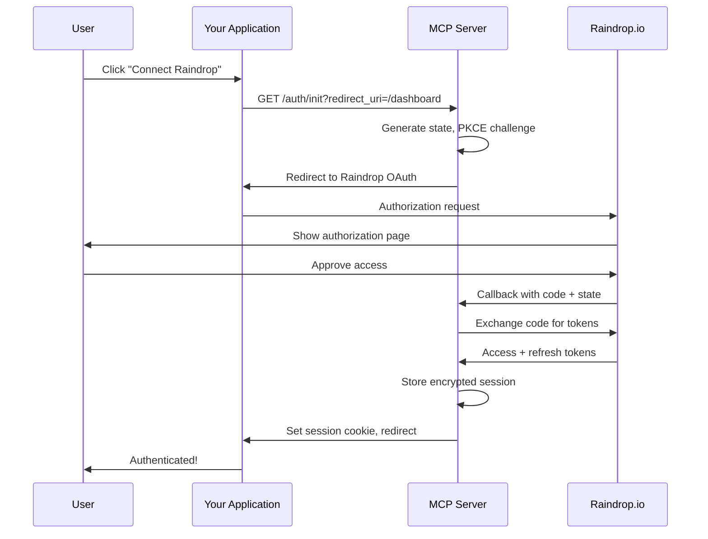

# OAuth 2.0 Authentication Guide

This guide covers setting up OAuth 2.0 authentication for the Raindrop MCP server, enabling secure multi-user access without sharing API tokens.

## Table of Contents

- [Overview](#overview)
- [Why Use OAuth?](#why-use-oauth)
- [Prerequisites](#prerequisites)
- [Getting OAuth Credentials](#getting-oauth-credentials)
- [Environment Configuration](#environment-configuration)
- [Vercel KV Setup](#vercel-kv-setup)
- [OAuth Flow](#oauth-flow)
- [Security Features](#security-features)
- [Testing OAuth](#testing-oauth)
- [Troubleshooting](#troubleshooting)

---

## Overview

The Raindrop MCP server supports OAuth 2.0 with PKCE (Proof Key for Code Exchange) for secure user authentication. This allows:

- **Multi-tenant support**: Multiple users can use the same server instance with their own Raindrop accounts
- **No token sharing**: Users authenticate directly with Raindrop.io
- **Token refresh**: Automatic token renewal without user re-authentication
- **Secure sessions**: Encrypted token storage with httpOnly cookies

## Why Use OAuth?

| Authentication Method | Use Case | Security | Multi-User |
|----------------------|----------|----------|------------|
| **OAuth 2.0** | Production deployment | ⭐⭐⭐⭐⭐ High | ✅ Yes |
| **Direct Token** | Personal use, development | ⭐⭐⭐ Medium | ❌ No |
| **Environment Token** | Local development | ⭐⭐ Low | ❌ No |

**Use OAuth when:**
- Deploying to production (Vercel, Cloudflare Workers)
- Supporting multiple users
- Building applications that integrate with Raindrop MCP
- You want automatic token refresh

**Use Direct Token when:**
- Personal use (single user)
- Quick development/testing
- Running locally with STDIO transport

---

## Prerequisites

1. **Raindrop.io Account** - [Sign up here](https://raindrop.io)
2. **Vercel Account** (for deployment) - [Sign up here](https://vercel.com/signup)
3. **Vercel KV** (for token storage) - Free tier available
4. **Node.js 18+** or Bun runtime

---

## Getting OAuth Credentials

### Step 1: Create OAuth Application

1. Go to [Raindrop.io Developer Apps](https://raindrop.io/dev/apps)
2. Click **"Create new application"**
3. Fill in application details:
   - **Name**: Your app name (e.g., "My MCP Server")
   - **Description**: Brief description of your application
   - **Icon**: Optional application icon

### Step 2: Configure Redirect URIs

After creating the app, configure the redirect URI:

**For Vercel Deployment:**
```
https://your-project.vercel.app/auth/callback
```

**For Local Development:**
```
http://localhost:3000/auth/callback
```

⚠️ **Important**: The redirect URI must **exactly match** your deployment URL. Include or exclude `www` and trailing slashes as appropriate.

### Step 3: Get Credentials

After creating the app, you'll receive:
- **Client ID** (e.g., `65a1b2c3d4e5f6g7h8i9j0k1`)
- **Client Secret** (e.g., `a1b2c3d4-e5f6-g7h8-i9j0-k1l2m3n4o5p6`)

⚠️ **Keep your Client Secret secure!** Never commit it to version control or expose it publicly.

---

## Environment Configuration

### Required Environment Variables

Add these to your `.env` file (local) or Vercel environment variables (production):

```bash
# OAuth Configuration
OAUTH_CLIENT_ID=your_client_id_here
OAUTH_CLIENT_SECRET=your_client_secret_here
OAUTH_REDIRECT_URI=https://your-project.vercel.app/auth/callback

# Security: Allowed Redirect URIs (comma-separated)
OAUTH_ALLOWED_REDIRECT_URIS=https://your-app.com/dashboard,/dashboard

# Token Encryption Key (generate with: openssl rand -hex 32)
TOKEN_ENCRYPTION_KEY=your_64_character_hex_encryption_key

# Vercel KV (automatically set when KV is linked)
KV_REST_API_URL=https://your-kv-instance.vercel-storage.com
KV_REST_API_TOKEN=your_kv_token
```

### Optional Environment Variables

```bash
# Fallback token for development (not used in production with OAuth)
RAINDROP_ACCESS_TOKEN=your_fallback_token

# Server configuration
NODE_ENV=production
PORT=3000
API_KEY=optional_server_api_key
CORS_ORIGIN=https://your-frontend.com
```

### Generating TOKEN_ENCRYPTION_KEY

The encryption key is used to encrypt tokens in storage. Generate a secure 64-character hex string:

**Using OpenSSL:**
```bash
openssl rand -hex 32
```

**Using Node.js:**
```bash
node -e "console.log(require('crypto').randomBytes(32).toString('hex'))"
```

**Example output:**
```
a1b2c3d4e5f6g7h8i9j0k1l2m3n4o5p6q7r8s9t0u1v2w3x4y5z6a7b8c9d0e1f2
```

---

## Vercel KV Setup

OAuth requires a storage backend for sessions and tokens. Vercel KV (Redis) is recommended for Vercel deployments.

### Step 1: Create KV Database

1. Go to [Vercel Dashboard](https://vercel.com/dashboard)
2. Navigate to **Storage** → **Create Database**
3. Select **KV (Redis)**
4. Choose a name (e.g., `raindrop-mcp-storage`)
5. Select region closest to your deployment
6. Click **Create**

### Step 2: Link to Project

1. Open your project in Vercel Dashboard
2. Go to **Storage** tab
3. Click **Connect Store**
4. Select your KV database
5. Click **Connect**

This automatically sets `KV_REST_API_URL` and `KV_REST_API_TOKEN` environment variables.

### Step 3: Verify Connection

After deployment, test the connection:

```bash
curl https://your-project.vercel.app/health
```

Should return:
```json
{
  "status": "ok",
  "oauth": true,
  "storage": "vercel-kv"
}
```

### Alternative: Local Development Storage

For local development without Vercel KV, the server uses in-memory storage (tokens are lost on restart):

```bash
# Run without KV_REST_API_URL set
npm run dev:http
```

⚠️ **Warning**: In-memory storage is not suitable for production. Always use Vercel KV or another persistent storage solution.

---

## OAuth Flow

### User Authentication Sequence



### Step-by-Step Flow

1. **Initiation** (`/auth/init`):
   - User clicks "Connect Raindrop" in your app
   - App redirects to `/auth/init?redirect_uri=/dashboard`
   - Server validates redirect URI against allowlist
   - Server generates state (CSRF token) and PKCE challenge
   - Server stores state temporarily in KV
   - User redirected to Raindrop.io authorization page

2. **Authorization** (Raindrop.io):
   - User sees "Authorize [Your App]" page
   - User clicks "Approve"
   - Raindrop redirects to your callback URL with authorization code

3. **Callback** (`/auth/callback`):
   - Server receives code and state parameters
   - Server validates state matches stored value (CSRF protection)
   - Server exchanges code for access/refresh tokens using PKCE verifier
   - Server fetches user info from Raindrop API
   - Server creates session with encrypted tokens
   - Server sets httpOnly session cookie
   - User redirected to original redirect_uri

4. **Authenticated Requests**:
   - Client includes session cookie in requests
   - Server extracts session ID from cookie
   - Server fetches and decrypts tokens from KV
   - Server validates token expiry
   - If expired, server refreshes token automatically
   - Request proceeds with valid access token

---

## Security Features

### 1. PKCE (Proof Key for Code Exchange)

Protects against authorization code interception attacks:

- Server generates random `code_verifier` (128 bytes)
- Server creates SHA-256 hash `code_challenge`
- Challenge sent to Raindrop, verifier kept secret
- During token exchange, verifier proves authenticity

### 2. State Parameter (CSRF Protection)

Prevents cross-site request forgery:

- Random UUID generated for each flow
- Stored in httpOnly cookie and server-side
- Validated during callback
- Expires after 5 minutes

### 3. Redirect URI Allowlist

Prevents open redirect attacks:

```env
OAUTH_ALLOWED_REDIRECT_URIS=https://myapp.com/dashboard,/dashboard
```

- Only URLs in allowlist are accepted
- Relative paths always allowed (e.g., `/dashboard`)
- Validation happens before OAuth flow starts
- Stored redirect_uri retrieved from server (not query param)

### 4. Token Encryption

Tokens encrypted at rest using AES-256-GCM:

- Encryption key from `TOKEN_ENCRYPTION_KEY` env var
- Unique IV (initialization vector) per token
- Authentication tags prevent tampering
- Keys never stored in plaintext

### 5. HttpOnly Cookies

Session cookies are httpOnly and secure:

```
Set-Cookie: mcp_session=...; HttpOnly; Secure; SameSite=Lax; Max-Age=1209600
```

- **HttpOnly**: JavaScript cannot access (prevents XSS)
- **Secure**: Only sent over HTTPS
- **SameSite=Lax**: CSRF protection
- **14-day expiration**: Automatic cleanup

### 6. Token Refresh

Access tokens automatically refreshed before expiry:

- Tokens typically expire in 14 days
- Refresh attempted when token within 1 hour of expiry
- Refresh token stored encrypted in KV
- Seamless for users (no re-authentication)

---

## Testing OAuth

### Manual Testing

1. **Start OAuth Flow**:

   Visit in browser:
   ```
   https://your-project.vercel.app/auth/init?redirect_uri=/dashboard
   ```

   You should be redirected to Raindrop.io authorization page.

2. **Authorize Application**:

   Click "Approve" on Raindrop's authorization page.

3. **Verify Redirect**:

   After authorization, you should be redirected back to:
   ```
   https://your-project.vercel.app/dashboard
   ```

   Check browser DevTools → Application → Cookies. You should see:
   - `mcp_session` cookie (httpOnly, secure)

4. **Test Authenticated Request**:

   ```bash
   curl https://your-project.vercel.app/mcp \
     -H "Cookie: mcp_session=YOUR_SESSION_ID" \
     -H "Content-Type: application/json" \
     -d '{"jsonrpc":"2.0","method":"tools/list","id":1}'
   ```

   Should return list of available MCP tools.

### Testing with MCP Inspector

Use the MCP Inspector to test the OAuth-enabled server:

```bash
# Install MCP Inspector
npm install -g @modelcontextprotocol/inspector

# Test OAuth server
mcp-inspector https://your-project.vercel.app/mcp
```

Follow prompts to authenticate via OAuth.

### Local Testing

For local OAuth testing:

1. Update Raindrop OAuth app with local redirect URI:
   ```
   http://localhost:3000/auth/callback
   ```

2. Set environment variables:
   ```bash
   OAUTH_REDIRECT_URI=http://localhost:3000/auth/callback
   OAUTH_ALLOWED_REDIRECT_URIS=/dashboard,/
   ```

3. Run local server:
   ```bash
   npm run dev:http
   ```

4. Visit:
   ```
   http://localhost:3000/auth/init?redirect_uri=/dashboard
   ```

---

## Troubleshooting

### Error: "redirect_uri parameter is required"

**Cause**: Missing `redirect_uri` in initial OAuth request.

**Solution**:
```bash
# Correct format
https://your-server.com/auth/init?redirect_uri=/dashboard
```

### Error: "invalid_redirect_uri"

**Cause**: Redirect URI not in allowlist.

**Solutions**:

1. Add to allowlist:
   ```env
   OAUTH_ALLOWED_REDIRECT_URIS=https://myapp.com/dashboard,/dashboard
   ```

2. Use relative path (always allowed):
   ```
   /auth/init?redirect_uri=/dashboard
   ```

### Error: "Invalid state" / "State parameter mismatch"

**Cause**: CSRF token mismatch (possible attack or cookies disabled).

**Solutions**:

1. Enable cookies in browser
2. Check `SameSite` cookie settings (should be `Lax`)
3. Ensure HTTPS in production (required for secure cookies)
4. Check if state expired (5-minute timeout)

### Error: "No allowed redirect URIs configured"

**Cause**: `OAUTH_ALLOWED_REDIRECT_URIS` not set.

**Solution**:
```env
OAUTH_ALLOWED_REDIRECT_URIS=https://your-app.com/dashboard,/dashboard
```

### Error: "Failed to exchange authorization code"

**Cause**: Invalid OAuth credentials or redirect URI mismatch.

**Solutions**:

1. Verify credentials in Raindrop Developer Console:
   - Client ID matches `OAUTH_CLIENT_ID`
   - Client Secret matches `OAUTH_CLIENT_SECRET`

2. Ensure `OAUTH_REDIRECT_URI` exactly matches Raindrop app configuration:
   ```env
   OAUTH_REDIRECT_URI=https://your-project.vercel.app/auth/callback
   ```

3. Check redirect URI in Raindrop app includes/excludes `www` as needed

### Error: "Token encryption key required"

**Cause**: Missing `TOKEN_ENCRYPTION_KEY`.

**Solution**:
```bash
# Generate key
openssl rand -hex 32

# Add to environment
TOKEN_ENCRYPTION_KEY=generated_key_here
```

### Error: "KV storage not configured"

**Cause**: Vercel KV not linked to project.

**Solutions**:

1. Link KV database in Vercel Dashboard → Storage
2. Verify environment variables are set:
   ```env
   KV_REST_API_URL=https://...
   KV_REST_API_TOKEN=...
   ```

3. For local development, server will use in-memory storage (warning shown)

### Tokens Not Refreshing

**Symptoms**: User must re-authenticate frequently.

**Solutions**:

1. Check refresh token is being stored:
   ```typescript
   // Should be in StoredSession
   refreshToken: "..."
   ```

2. Verify token refresh logic in `oauth.service.ts`:
   - Refresh attempted when `expiresAt - Date.now() < 3600000` (1 hour)

3. Check Raindrop API response includes refresh token:
   ```json
   {
     "access_token": "...",
     "refresh_token": "...",
     "expires_in": 1209600
   }
   ```

### Session Cookies Not Setting

**Symptoms**: No `mcp_session` cookie in browser.

**Solutions**:

1. Ensure HTTPS in production (secure cookies require it)
2. Check `Set-Cookie` headers in response:
   ```
   Set-Cookie: mcp_session=...; HttpOnly; Secure; SameSite=Lax
   ```

3. Verify domain matches (no cross-domain cookie issues)
4. Check browser allows third-party cookies if embedded

---

## Production Checklist

Before deploying OAuth to production:

- [ ] OAuth credentials created in Raindrop Developer Console
- [ ] `OAUTH_CLIENT_ID` and `OAUTH_CLIENT_SECRET` set in Vercel
- [ ] `OAUTH_REDIRECT_URI` exactly matches Raindrop app configuration
- [ ] `OAUTH_ALLOWED_REDIRECT_URIS` configured with production URLs
- [ ] `TOKEN_ENCRYPTION_KEY` generated and set (64 hex chars)
- [ ] Vercel KV database created and linked
- [ ] `KV_REST_API_URL` and `KV_REST_API_TOKEN` automatically set
- [ ] HTTPS enabled (automatic with Vercel)
- [ ] Test OAuth flow end-to-end
- [ ] Test token refresh works correctly
- [ ] Verify session cookies are httpOnly and secure
- [ ] Monitor error logs for OAuth issues

---

## Best Practices

### Security

1. **Rotate secrets regularly**: Change `TOKEN_ENCRYPTION_KEY` and `OAUTH_CLIENT_SECRET` periodically
2. **Use HTTPS always**: Never use OAuth over HTTP in production
3. **Minimize redirect URIs**: Only add necessary URLs to allowlist
4. **Monitor failed logins**: Track failed OAuth attempts for suspicious activity
5. **Limit session duration**: Default 14 days is reasonable, adjust as needed

### Performance

1. **Cache user info**: Store Raindrop user details in session to reduce API calls
2. **Refresh proactively**: Refresh tokens before expiry (current: 1 hour before)
3. **Use KV efficiently**: Set appropriate TTLs on stored states (current: 5 minutes)

### User Experience

1. **Clear error messages**: Show user-friendly errors (not raw OAuth errors)
2. **Preserve redirect**: Always redirect to original `redirect_uri` after auth
3. **Handle re-authentication**: Gracefully prompt re-auth when session expires
4. **Loading states**: Show spinners during OAuth redirects

---

## Additional Resources

- [Raindrop.io API Documentation](https://developer.raindrop.io)
- [OAuth 2.0 RFC 6749](https://datatracker.ietf.org/doc/html/rfc6749)
- [PKCE RFC 7636](https://datatracker.ietf.org/doc/html/rfc7636)
- [Vercel KV Documentation](https://vercel.com/docs/storage/vercel-kv)
- [Model Context Protocol](https://modelcontextprotocol.io)

---

## Need Help?

- 🐛 [Report Issues](https://github.com/Aarekaz/raindrop-mcp/issues)
- 💬 [Discussions](https://github.com/Aarekaz/raindrop-mcp/discussions)
- 📧 Email: anuragdhungana5@gmail.com
